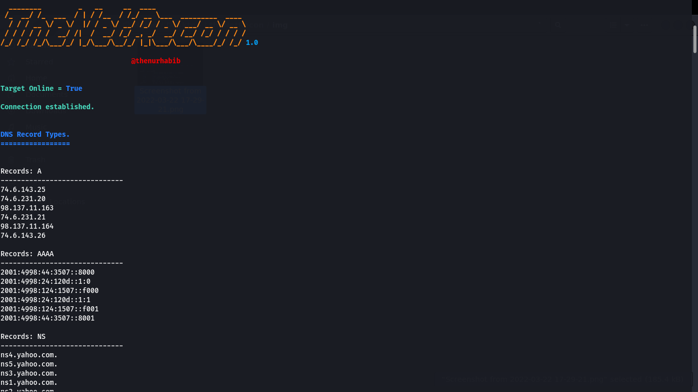
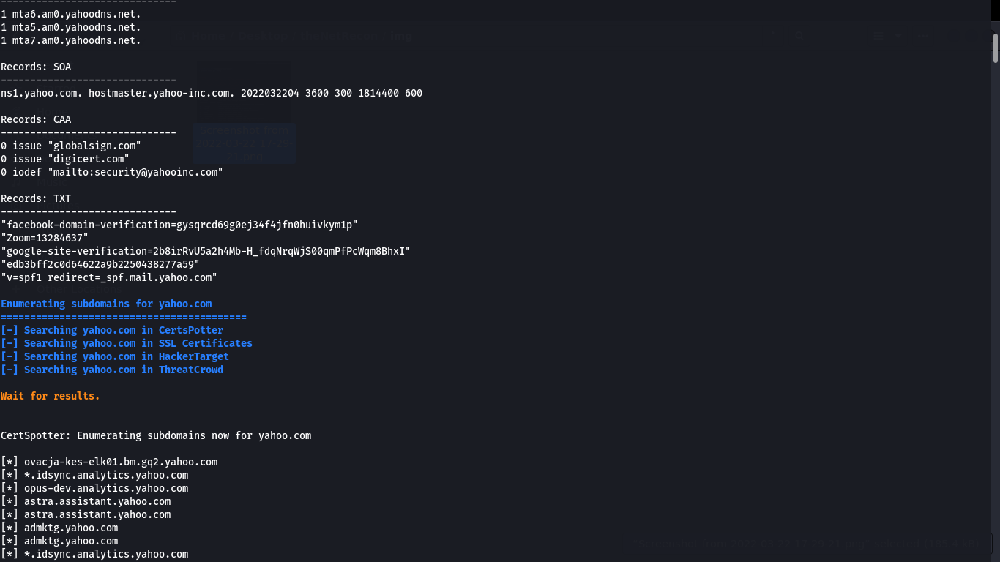
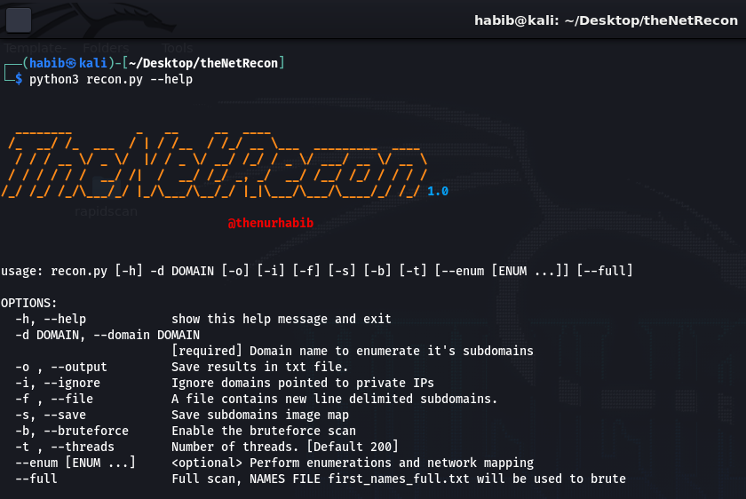
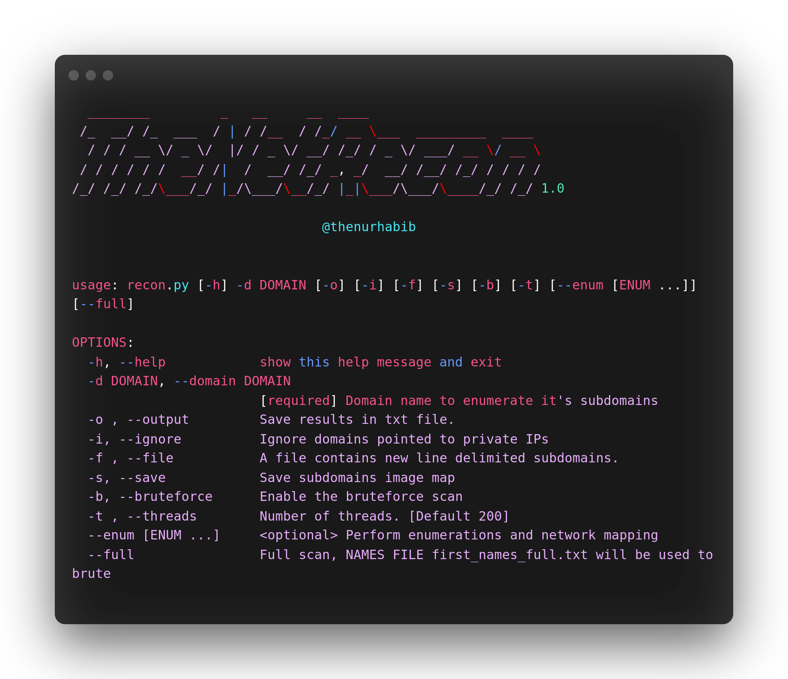

<h1 align="center">
  <br>
  <a  href="https://github.com/thenurhabib/thenetrecon"></a>
  <br>
  TheNetRecon
  <br>
</h1>

<h4 align="center">Fastest tool for Enumerate subdomain and network scanning.</h4>

<p align="center">
  <a href="https://github.com/thenurhabib/thenetrecon/releases">
    
  </a>
  <a href="https://travis-ci.com/thenurhabib/thenetrecon">
    
  </a>
  <a href="https://github.com/thenurhabib/thenetrecon/issues?q=is%3Aissue+is%3Aclosed">
      
  </a>
</p>




<hr>

### thenetrecon is a fastest tool to detect Cross Site scripting (XSS), SQL Injection, and automatically check urls for any sensetive information. and it's also used for numerate subdomain and network scanning.

<br>

### Main Features
- Find XSS
- Find SQL Injection
- Check URL for important Information.

- Enumirating Subdomains from 4 sources
   - CertsPotter
   - SSL Certificates
   - HackerTarget
   - ThreatCrowd

- Records: 
  - TXT Records
  - CCA Records
  - SOA Records
  - MX Records
  - NS Records
  - AAAA Records
  - A Records
- Advance Error Handling


<br>



<br>


### Documentation
### install
```yaml
git clone https://github.com/thenurhabib/thenetrecon.git
cd thenetrecon
python -m pip install -r requirements.txt
python3 thenetrecon.py --help
```


#### Usage

```yaml

OPTIONS:
  -h, --help            show this help message and exit
  -d DOMAIN, --domain DOMAIN
                        [required] Domain name to enumerate it's subdomains
  -o , --output         Save results in txt file.
  -i, --ignore          Ignore domains pointed to private IPs
  -f , --file           A file contains new line delimited subdomains.
  -s, --save            Save subdomains image map
  -b, --bruteforce      Enable the bruteforce scan
  -t , --threads        Number of threads. [Default 200]
  --enum [ENUM ...]     <optional> Perform enumerations and network mapping
  --full                Full scan, NAMES FILE first_names_full.txt will be used to brute
                                                                        
```
<br>



### Author
```yaml
Name       : Md. Nur habib
Medium     : thenurhabib.medium.com
Twitter    : https://twitter.com/thenurhab1b
HackerRank : https://www.hackerrank.com/thenurhabib

```

##### Thank You.
